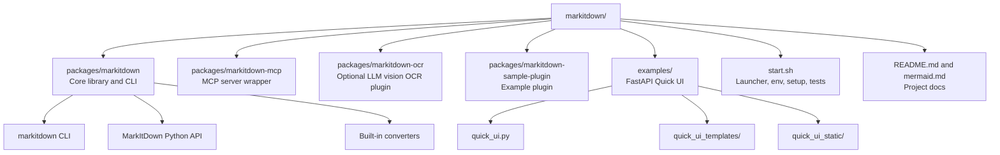
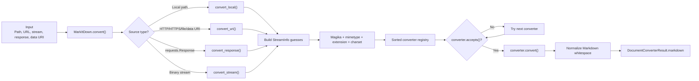
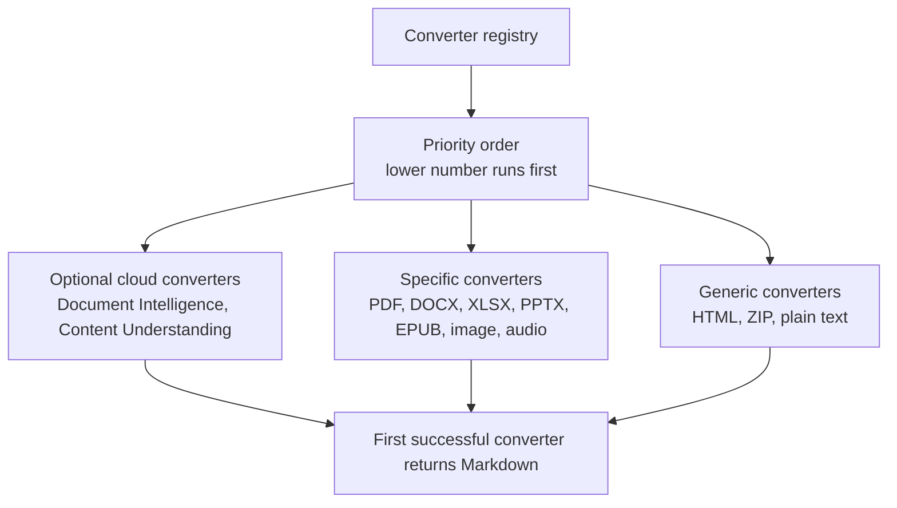
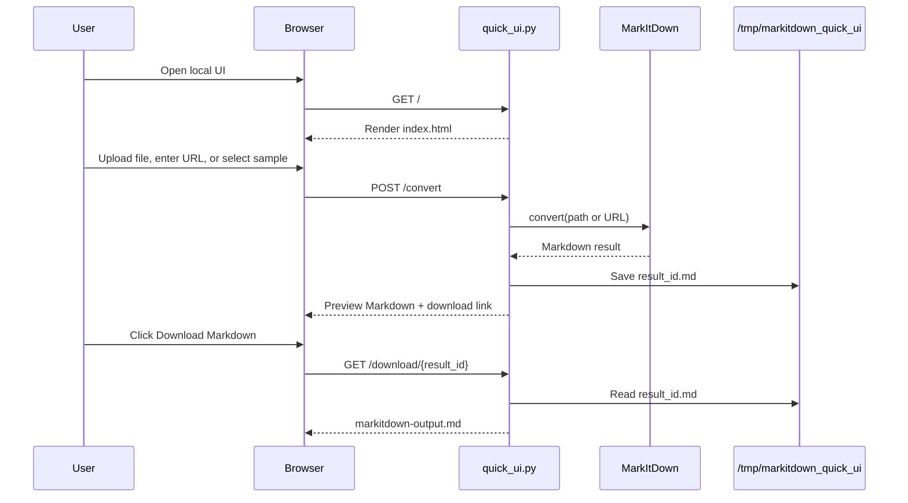
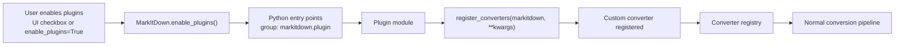
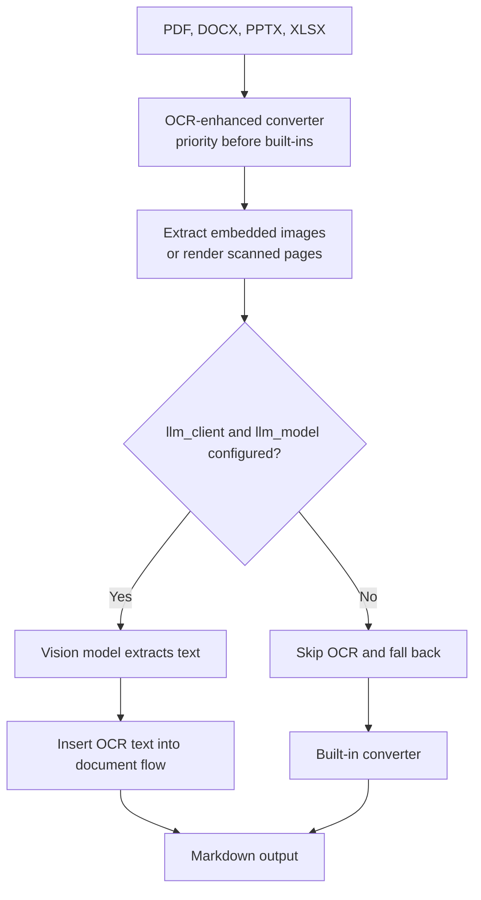
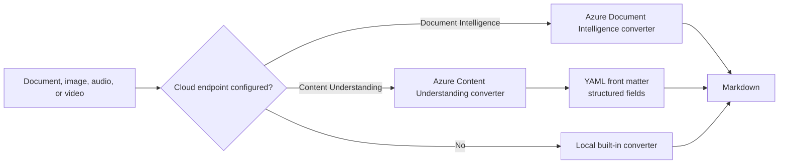
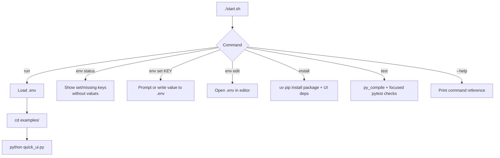
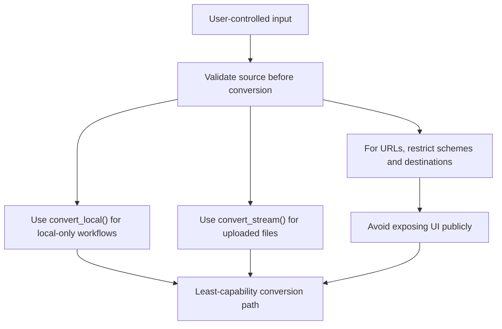
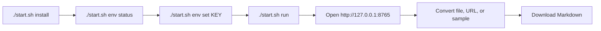

# MarkItDown Workbench Architecture

This file uses Mermaid diagrams to show how this Microsoft MarkItDown-based project is organized and how data moves through the converter, UI, plugins, and optional cloud integrations.

## Repository Map

## Main Conversion Pipeline

## Converter Selection

## FastAPI Quick UI Flow

## Plugin Flow

## OCR Plugin Path

## Optional Cloud Conversion

## Launcher Flow

## Security Boundaries

## Typical Local Workflow

